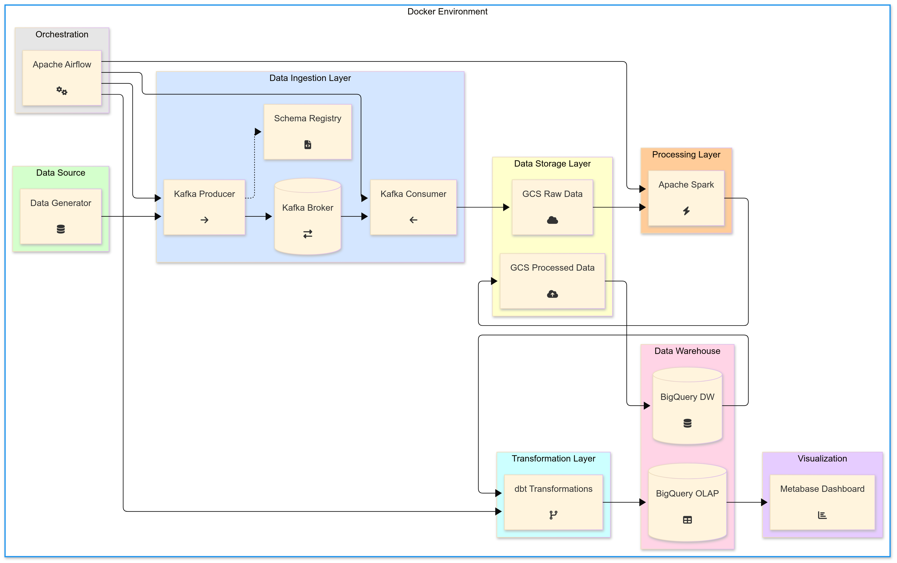
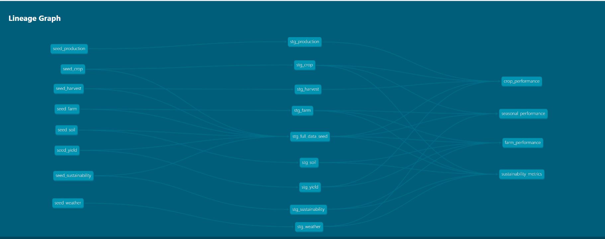

# Agricultural Data Pipeline

## Problem Statement

This project addresses the challenges of collecting, processing, and analyzing agricultural data at scale. The agricultural sector generates massive amounts of data from various sources including weather stations, soil sensors, farm equipment, and satellite imagery. However, this data is often siloed, inconsistently formatted, and difficult to analyze in real-time.

Our solution is an end-to-end data pipeline that:
1. Collects agricultural data in real-time
2. Processes and standardizes the data
3. Stores it in a scalable data warehouse
4. Transforms it for analytical use cases
5. Visualizes key agricultural metrics for decision making

## Project Architecture



```
+----------------+      +----------------+      +-------------------+
| Data Sources   |      | Streaming      |      | Storage           |
| -------------- | ---> | Pipeline       | ---> | --------------    |
| Agri Data Gen  |      | Kafka          |      | Google Cloud      |
+----------------+      +----------------+      | Storage (GCS)     |
                                                +-------------------+
                                                         |
                                                         v
+----------------+      +----------------+      +-------------------+
| Visualization  |      | Transformation |      | Batch Processing  |
| -------------- | <--- | -------------- | <--- | --------------    |
| Metabase       |      | dbt            |      | Apache Spark      |
+----------------+      +----------------+      +-------------------+
                                |
                                v
                        +-------------------+
                        | Data Warehouse    |
                        | --------------    |
                        | BigQuery          |
                        +-------------------+
                                |
                                v
                        +-------------------+
                        | Orchestration     |
                        | --------------    |
                        | Apache Airflow    |
                        +-------------------+
```

*Note: To generate a proper architecture diagram, you can use tools like draw.io, Mermaid, or Lucidchart using the structure provided above.*

### Directory Structure

```
agri_data_pipeline/
├── batch_pipeline/             # Batch processing using Spark
│   ├── export_to_big_query/    # Scripts to load data to BigQuery
│   ├── export_to_gcs/          # Scripts to export processed data to GCS
│   ├── processed_data/         # Output from batch processing
│   └── jars/                   # Dependencies for Spark
├── business_transformations/   # Business logic and transformations
├── docker/                     # Docker configurations
├── logs/                       # Application logs
├── scripts/                    # Utility scripts
│   ├── dbt/                    # dbt scripts for data transformations
│   └── ...
├── streaming_pipeline/         # Streaming data processing
│   ├── data_producer.py        # Kafka producer for streaming data
│   ├── data_consumer.py        # Kafka consumer
│   └── kafka_to_gcs_dag.py     # Airflow DAG for Kafka to GCS
├── terraform/                  # Infrastructure as Code
├── .env                        # Environment variables
├── .env.example                # Example environment file
├── build.sh                    # Build script
├── requirements.txt            # Python dependencies
└── README.md                   # Project documentation
```

## Technologies Used

### Cloud
- **Google Cloud Platform (GCP)**
  - Google Cloud Storage (GCS) for data lake
  - BigQuery for data warehouse
  - Compute Engine for hosting services
- **Infrastructure as Code**
  - Terraform for provisioning cloud resources

### Data Ingestion
- **Streaming Pipeline**
  - Apache Kafka for real-time data streaming
  - Confluent Schema Registry for schema management
  - Custom Kafka producers and consumers
- **Workflow Orchestration**
  - Apache Airflow for scheduling and monitoring workflows
  - DAGs for both streaming and batch pipelines

### Data Warehouse
- **BigQuery**
  - Partitioned tables by date for optimized query performance
  - Clustered by farm_id and crop_type to improve analytical queries
  - Separate OLAP tables for business intelligence

### Transformations
- **dbt (data build tool)**
  - Models for transforming raw data into analytics-ready datasets
  - Tests to ensure data quality
  - Documentation for data lineage



- **Apache Spark**
  - Data cleansing and normalization
  - Feature engineering for agricultural metrics

### Dashboard
- **Metabase**
  - Interactive dashboards for agricultural insights
  - Charts showing crop yield predictions
  - Visualizations of weather impact on crop performance
  - Time series analysis of soil conditions

## Setup Instructions

### Prerequisites
- Docker and Docker Compose
- Google Cloud Platform account and project
- Python 3.8+ with pip
- Java JDK 11
- Network connectivity to download Docker images
- At least 8GB of RAM available for Docker

### Step-by-Step Setup

1. **Clone the repository:**
   ```bash
   git clone <repository-url>
   cd agri_data_pipeline
   ```

2. **Set up GCP credentials:**
   - Create a service account with BigQuery Admin, Storage Admin, and Dataflow Admin permissions
   - Download the JSON key file and save it as `gcp-creds.json` in the project root

3. **Configure environment variables:**
   ```bash
   cp .env.example .env
   ```
   Edit the `.env` file to update:
   - `GCP_PROJECT_ID` - Your Google Cloud project ID
   - `GCS_BUCKET_NAME` - Name of your GCS bucket
   - Other settings as needed

4. **Deploy cloud infrastructure:**
   ```bash
   cd terraform
   terraform init
   terraform apply
   cd ..
   ```

5. **Start the services:**
   ```bash
   # Make the build script executable
   chmod +x build.sh
   
   # Run the automated setup script
   ./build.sh
   ```

6. **Verify the setup:**
   - Kafka Control Center: http://localhost:9021
   - Airflow: http://localhost:8080
   - Spark Master UI: http://localhost:8088
   - Metabase: http://localhost:3010

## Data Pipeline Workflow

1. **Data Generation and Ingestion:**
   - Synthetic agricultural data is generated and sent to Kafka topics
   - Data includes farm information, crop data, weather metrics, and soil properties

2. **Streaming Processing:**
   - Kafka consumers process the data in real-time
   - Processed data is stored in Google Cloud Storage

3. **Batch Processing:**
   - Apache Spark jobs process the data in batches
   - Transformations include data cleaning, normalization, and feature engineering

4. **Data Warehouse Loading:**
   - Processed data is loaded into BigQuery tables
   - Tables are optimized for analytical queries

5. **dbt Transformations:**
   - dbt models transform the data for specific business use cases
   - Tests ensure data quality and integrity

6. **Visualization:**
   - Metabase dashboards provide insights into agricultural data
   - Interactive charts show trends and patterns

## Dashboard Overview

The Metabase dashboard includes:

1. **Crop Yield Analysis**
   - Bar chart showing yield by crop type
   - Time series of yield trends over seasons

2. **Weather Impact Visualization**
   - Correlation between rainfall and crop performance
   - Temperature effects on different crop varieties

3. **Soil Health Monitoring**
   - Nutrient levels by farm and field
   - pH balance tracking over time

4. **Farm Performance Comparison**
   - Regional performance benchmarking
   - Efficiency metrics by farm size

## Troubleshooting

If you encounter any issues:

1. Check the logs in the `logs/` directory
2. Ensure all environment variables are set correctly in `.env`
3. Verify GCP credentials are valid
4. Check Docker container status with `docker ps`
5. For Kafka issues, use the Control Center UI for debugging

## Service Ports

| Service | Port | Description |
|---------|------|-------------|
| Kafka Broker | 9092 | Kafka message broker |
| Schema Registry | 8081 | Confluent Schema Registry |
| Kafka Control Center | 9021 | Confluent Control Center UI |
| PostgreSQL | 5432 | Main PostgreSQL database |
| Airflow Webserver | 8080 | Airflow UI and API |
| Spark Master UI | 8088 | Spark master web interface |
| Metabase | 3010 | Metabase analytics dashboard |
| DBT Docs | 8085 | DBT documentation server |

## Future Enhancements

1. Add real-time alerts based on anomaly detection
2. Implement machine learning models for crop yield prediction
3. Expand the dashboard with more agricultural metrics
4. Add support for satellite imagery analysis
5. Implement CI/CD pipeline for automated deployment

## Contributors

- Abhay Ahirkar - Project Author
